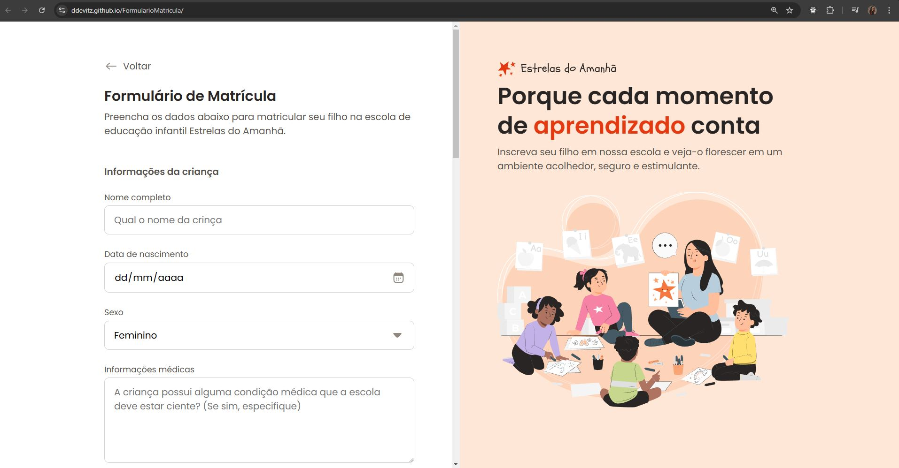
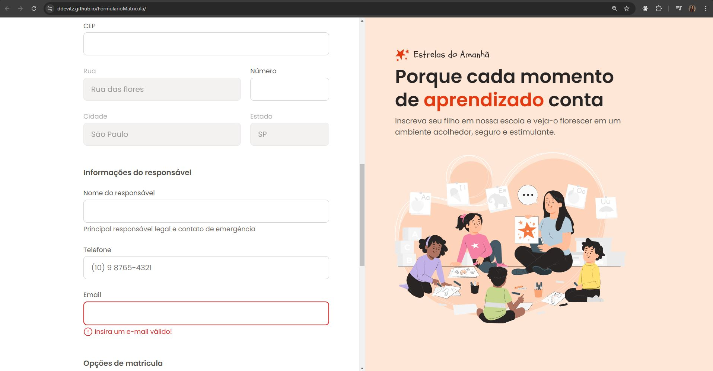
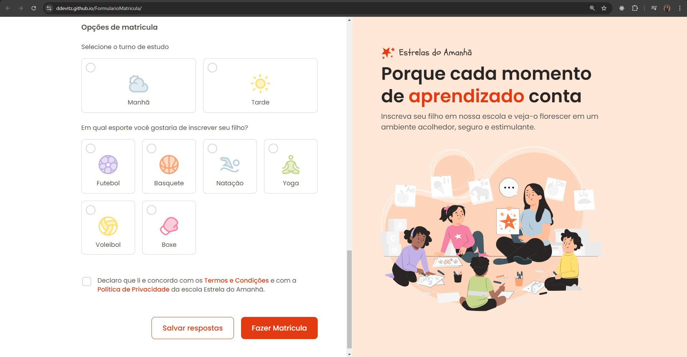

# Formulário de matrícula

Avançando nos aprendizados de HTML e CSS
## Aprendendo sobre:

- Criação de formulários em HTML, abordando campos:
    - Entrada de texto
    - Data
    - Seleção
    - Text area 
    - Envio de arquivos

## Referência

Formulário de matrícula é uma aplicação web. Esse projeto é desenvolvido nas formações da Rocketseat.

 - [Formulário de matrícula - Rocketseat](https://www.figma.com/community/file/1365016793556649696)
## Screenshots

